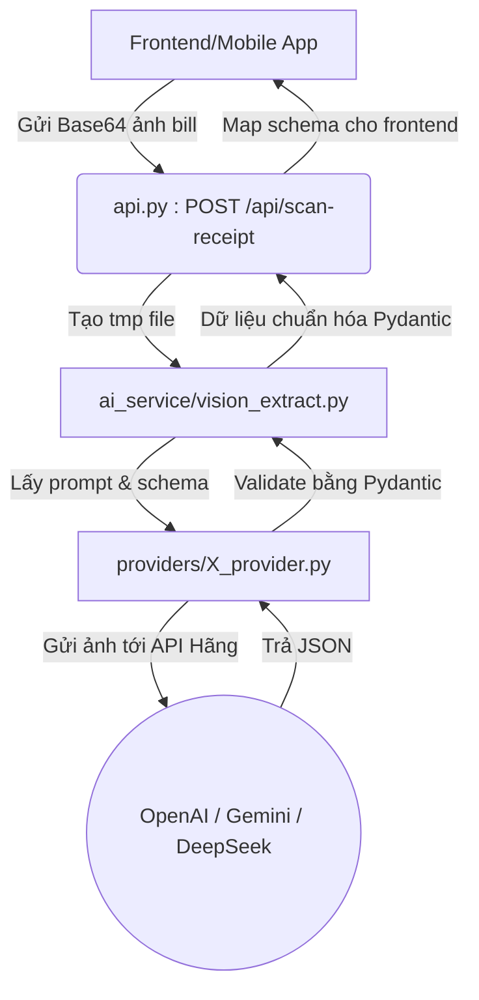

# Phân tích chi tiết hệ thống Smart Bill Splitting

Thư mục `smart-bill-splitting` là một backend/AI service được viết bằng Python. Nhiệm vụ chính của hệ thống này là nhận ảnh chụp hóa đơn (bill) từ các nhà hàng/quán ăn tại Việt Nam, sử dụng các mô hình AI có khả năng xử lý hình ảnh (Vision LLM) để trích xuất thông tin, và trả về dữ liệu dưới định dạng JSON có cấu trúc.

Dưới đây là phân tích chi tiết về kiến trúc và các thành phần trong thư mục này:

## 1. Cấu trúc thư mục (Directory Structure)
```text
smart-bill-splitting/
├── api.py                  # API server chính bằng FastAPI
├── run_test.py             # Script để chạy test đơn lẻ
├── run_compare.py          # Script so sánh kết quả giữa các LLM
├── requirements.txt        # Các thư viện phụ thuộc
├── .env.example            # Chứa mẫu các biến môi trường
├── ai_service/             # Module xử lý AI cốt lõi
│   ├── config.py           # File cấu hình (đọc từ .env)
│   ├── prompt_template.py  # Chứa Prompt cho AI (System & User)
│   ├── schema.py           # Định nghĩa cấu trúc dữ liệu JSON đầu ra (Pydantic)
│   ├── vision_extract.py   # Code điều phối gọi các Provider AI
│   └── providers/          # Chứa logic kết nối cụ thể tới OpenAI, Gemini, DeepSeek
│       ├── base.py
│       ├── openai_provider.py
│       ├── gemini_provider.py
│       └── deepseek_provider.py
├── test_data/              # Chứa các ảnh bill mẫu để test
└── logs/                   # Chứa các file log sau khi test
```

## 2. Phân tích chi tiết từng thành phần

### 2.1. API Server (`api.py`)
- Sử dụng **FastAPI** để tạo ra một HTTP Server.
- Cung cấp endpoint: `POST /api/scan-receipt`.
- **Luồng hoạt động**:
  1. Nhận chuỗi ảnh mã hóa dạng Base64 từ Frontend.
  2. Lưu tạm ảnh ra một file (`.jpg`) trong ổ cứng bằng thư viện `tempfile`.
  3. Gọi hàm `extract_bill()` từ thư mục `ai_service` để nhờ AI đọc bill.
  4. Sau khi có kết quả trả về từ AI (kiểu dữ liệu Pydantic), `api.py` sẽ **map (chuyển đổi)** cấu trúc dữ liệu về đúng schema mà Frontend (hoặc Cloudflare Worker) mong đợi. Chẳng hạn, tách riêng "món ăn" (type: food) và "phí chung" (shared_fee, VAT, Service Charge).
  5. Trả về cho Frontend và xóa file ảnh tạm đi.

### 2.2. Khối AI Service (`ai_service/`)
Đây là "trái tim" của hệ thống xử lý bóc tách hóa đơn.
- **`schema.py`**: Sử dụng `Pydantic` để định nghĩa rõ hóa đơn sẽ có trường gì (Ví dụ: `restaurant_name`, `items`, `sub_total`, `grand_total`...). Mỗi món ăn (`BillItem`) sẽ được phân loại thành `food`, `shared_fee` (phí chung) hoặc `combo`. AI khi trả về phải khớp tuyệt đối với schema này, nếu không sẽ bị parse lỗi.
- **`prompt_template.py`**: Chứa lời dẫn (prompt) vô cùng kỹ lưỡng hướng dẫn mô hình AI cách đọc bill tiếng Việt. Prompt hướng dẫn xử lý cả những tình huống khó (như gộp món, VAT, phí dịch vụ) và yêu cầu AI chấm điểm tự tin (`confidence score`) cho từng dòng xem có bị mờ hay đọc nhầm không.
- **`vision_extract.py`**: Là một Orchestrator (trung tâm điều phối). Hỗ trợ:
  - Gọi một model AI duy nhất (`extract_bill`).
  - Gọi AI với cơ chế dự phòng (`extract_bill_with_fallback`): Nếu model A (VD: OpenAI) bị lỗi mạng hay sập, tự động đổi qua gọi model B (VD: Gemini).
  - Chế độ so sánh model (`extract_bill_compare`): Chạy đồng thời nhiều mô hình và so sánh xem mô hình nào đọc chuẩn và bắt được nhiều items hơn.
- **`providers/`**: Thiết kế theo pattern Strategy. Có một lớp `BaseProvider` cơ sở, và các class `OpenAIProvider`, `GeminiProvider`, `DeepSeekProvider` kế thừa từ đó. Việc thiết kế này giúp hệ thống rất dễ mở rộng (ví dụ sau này muốn thêm Claude thì chỉ cần viết `claude_provider.py` mà không phải sửa hay can thiệp vào các logic khác).

### 2.3. Các công cụ kiểm thử (Testing Scripts)
- **`run_test.py`**: Dùng để duyệt qua toàn bộ ảnh chụp trong thư mục `test_data/`, tự động gọi AI để bóc tách từng bill và in kết quả ra màn hình (thành công hoặc thất bại, cảnh báo về độ tin cậy mờ). Toàn bộ kết quả (log) sẽ được ghi vào thư mục `logs/extraction_log.json`.
- **`run_compare.py`**: Dùng để chạy so sánh đối đầu song song (A/B testing) giữa OpenAI GPT-4o và Google Gemini Flash trên cùng một bộ bill. Script sẽ tính toán xem grand_total (tổng tiền) của hai bên có khớp nhau không, ai bắt được nhiều món hơn, và đưa ra gợi ý (recommendation) nên dùng model nào.

## 3. Sơ đồ luồng hoạt động (Workflow)



## 4. Điểm sáng của kiến trúc này
1. **Tính bền vững (Robustness)**: Sử dụng cấu trúc Pydantic nghiêm ngặt, ép AI phải trả về JSON format cố định. Do đó, frontend sẽ luôn nhận được dữ liệu có cấu trúc hoàn chỉnh.
2. **Dễ dàng mở rộng (Scalability)**: Tách riêng interface Providers giúp việc thêm bớt các AI models mới rất nhanh.
3. **Cơ chế Fallback thông minh**: Việc tự động chuyển model dự phòng giúp API không bao giờ bị "chết" vì một LLM Provider đang sập.
4. **Logic chuyên sâu cho bài toán Bill Splitting**: Hệ thống tự động bóc tách các dòng "phí chung" (shared_fee như VAT, phí dịch vụ, khăn lạnh) với các món ăn "cá nhân". Rất hoàn hảo cho nghiệp vụ chia tiền.
